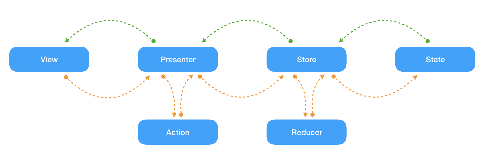

 

Redux ToDo List
===============

This repository shows how I've implemented Redux architecture on Android using Kotlin and Coroutines. Basically the code implements all the architecture stuffs, like as Stores, 
Reducers, Actions and States. If you wanna learn more about this architecture you can take a look to the official web-site [redux.js](https://redux.js.org/)

## Under the hood

### States

The State represents the application state, whole the application state. In my case, contains the ToDo list also persists this in memory storage.
  
### Actions

The Actions represent all the edit operations those change the application state, in my case, I've just one and it manage he addition of new ToDo items to the list.
 
### Reducers

The Reducers are the responsible of containing the edition's logic for the state. I mean, They have the responsibility of do all the write operations over the state. Also are pure 
functions, that means that those cl

### Store

The Store represent exactly the same as its name says, is the storage / persistence layer of the architecture. With particularity that thsi state is immutable and only the 
reducers have privileges to modify its.

## License

Copyright Txus Ballesteros 2018 (@txusballesteros)

This file is part of some open source application.

Licensed to the Apache Software Foundation (ASF) under one
or more contributor license agreements.  See the NOTICE file
distributed with this work for additional information
regarding copyright ownership.  The ASF licenses this file
to you under the Apache License, Version 2.0 (the
"License"); you may not use this file except in compliance
with the License.  You may obtain a copy of the License at

  http://www.apache.org/licenses/LICENSE-2.0

Unless required by applicable law or agreed to in writing,
software distributed under the License is distributed on an
"AS IS" BASIS, WITHOUT WARRANTIES OR CONDITIONS OF ANY
KIND, either express or implied.  See the License for the
specific language governing permissions and limitations
under the License.

Contact: Txus Ballesteros <txus.ballesteros@gmail.com>